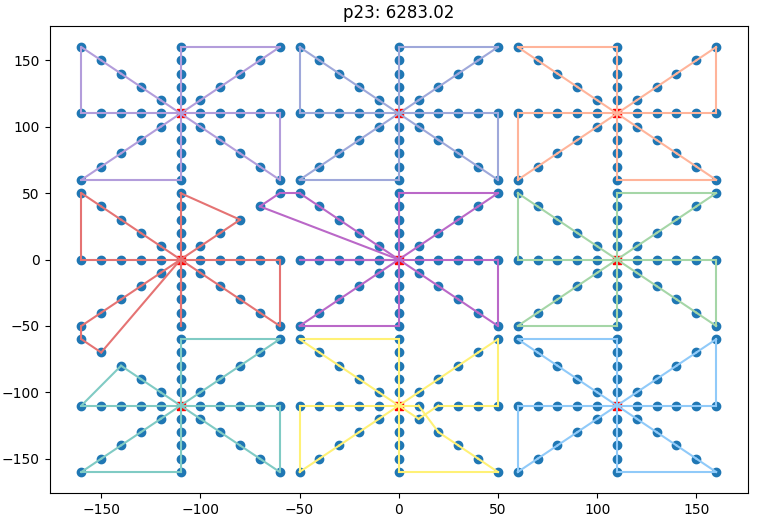

# MDVRP
A genetic algorithm for solving the multi-depot vehicle routing problem, 
implemented in Java.

The solver takes in a .txt-file of information on number of vehicles and
numbers and locations of depots and customers.

The output is a .txt-file with information on the route for each vehicle,
which is also vizualized in Python.

### Example Output

